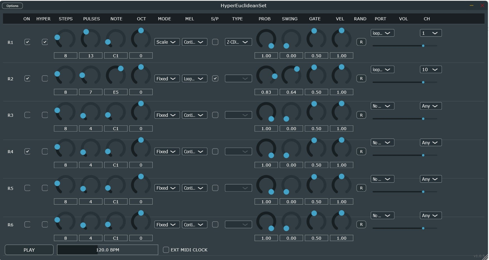

**HyperEuclideanSet** **(**aka **HyperEuclidean** **MIDI**
**Generator)** is a 6-track algorithmic sequencer based on Euclidean
rhythm geometry. Instead of traditional step-by-step programming, you
define the "density" of notes within a time space, allowing for the
creation of complex polyrhythms and generative melodies in
seconds.

Added MIDI Learn (for liveperformance). 

Read the user manual for usage details.

Todo:

>
> Fix the GUI
>
> Optimize CPU load and startup times (especially for standalone)
>
> Other ...

Thanks for theinspiration to Andreas Sandersen (sandy999999) with his
“Rhythm-generator” here

[<u>https://github.com/sandy999999/rhythm-generator</u>](https://github.com/sandy999999/rhythm-generator))
and to Paul V. Miller (lauprellim) with his

“Higher-order Euclidean Sets” here
[<u>https://github.com/lauprellim/euclid</u>](https://github.com/lauprellim/euclid)
.
